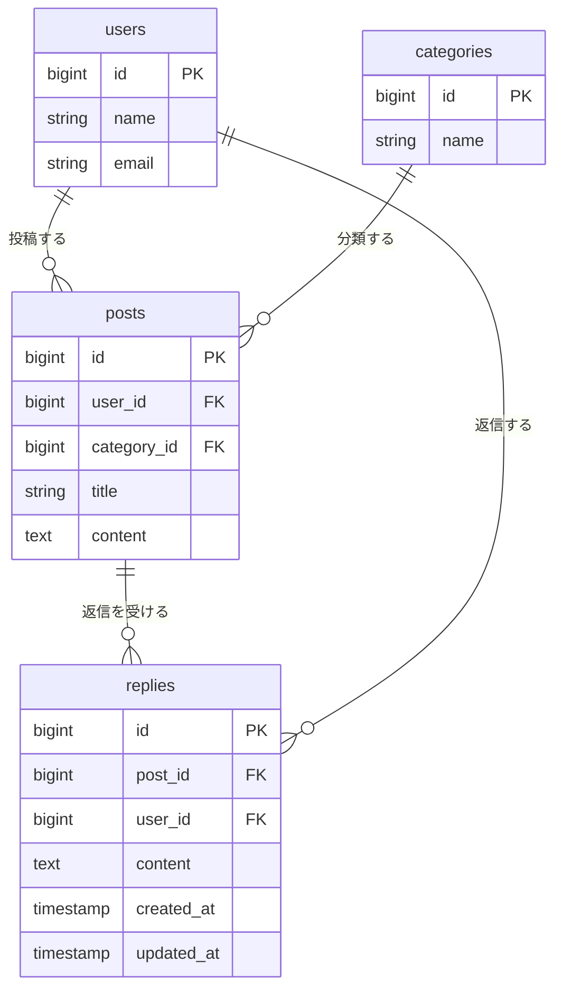

# リプライ機能の設計

Issue #1「ポストにリプライ機能を追加する」の設計書です。

## 概要

ポストを読んだ人が、その場で一言返せるようにする。今は読むだけで、返す手段がない。

- ポストを 1 件開く画面（ポスト詳細）を新しく作り、そこにそのポストへのリプライの一覧と入力欄を置く
- 入口は、タイムラインの各ポストの操作欄に足す「返信」リンク
- リプライは、ポストに直接ぶら下がる 1 段だけ（リプライへのリプライはしない）
- 削除できるのはリプライの投稿者本人だけ。判定は `app/Policies/PostPolicy.php` と同じく、ログイン中のユーザーの ID とリプライの `user_id` が同じかどうかで決める
- すべてログインが必要。ログインしていないときは、ほかの画面と同じくログイン画面へ移動する

## 受け入れ条件

- [ ] ポストを 1 件開くと、そのポストとリプライの一覧が見える
- [ ] 本文を入れてリプライを送ると、一覧に増える
- [ ] 本文が空のままだと、エラーが表示されてリプライは増えない
- [ ] 自分のリプライは消せて、他人のリプライは消せない

## 変えないもの

- タイムライン（`/posts`）の今の動き（一覧・編集・削除）は変えない
  - 並び順、表示項目、編集・削除ボタンの出し分けは今のまま
  - 足すのは、各ポストの操作欄の「返信」リンク 1 つだけ。ポストの持ち主かどうかに関係なく、ログインしていれば全員に出す
- 既存のテーブル（`users`・`posts`・`categories`）の列は変えない
- ポストの編集・削除の認可（`PostPolicy`）は変えない

## 増えるテーブル

`replies` テーブルを 1 つ足す。

| 列 | 型 | 制約 | 内容 |
|:--|:--|:--|:--|
| `id` | bigint unsigned | 主キー | リプライ ID |
| `post_id` | bigint unsigned | 外部キー（`posts.id`）、ポスト削除で連動削除 | 返信先のポスト |
| `user_id` | bigint unsigned | 外部キー（`users.id`）、ユーザー削除で連動削除 | リプライの投稿者 |
| `content` | text | 必須 | 本文（140 字以内） |
| `created_at` | timestamp | | 作成日時（並び順に使う） |
| `updated_at` | timestamp | | 更新日時 |

- ポストを消すと、そのポストのリプライも一緒に消える
- ユーザーを消すと、そのユーザーのリプライも一緒に消える
- 「リプライへのリプライ」はしないので、`replies` 自身を指す列（親リプライの ID）は持たない

## 増える画面

### ポスト詳細（新規）

| 項目 | 内容 |
|:--|:--|
| URL | `GET /posts/{post}` |
| 名前 | `posts.show` |
| 表示できる人 | ログインしているユーザー全員 |
| 存在しないポスト | 404 |

画面の構成（上から順）:

1. ヘッダー（アプリ名、ログイン中のユーザー、ログアウト）と、タイムラインへ戻るリンク
2. 対象のポスト（投稿者、日時、カテゴリ、タイトル、本文）
3. リプライの入力欄（本文のテキストエリアと「返信する」ボタン）。入力エラーはここに出す
4. リプライの一覧（新しい順）。各リプライに投稿者、日時、本文を出す。自分のリプライにだけ「削除」ボタンを出す
5. リプライが 0 件のときは「まだリプライがありません。」を出す

### リプライの送信・削除（画面は持たず、詳細画面に戻る）

| 操作 | メソッド・URL | 名前 | 成功したとき | 失敗したとき |
|:--|:--|:--|:--|:--|
| 送信 | `POST /posts/{post}/replies` | `replies.store` | ポスト詳細に戻る（一覧の一番上に増える） | 入力エラー: ポスト詳細に戻り、エラーと入力途中の本文を表示 |
| 削除 | `DELETE /replies/{reply}` | `replies.destroy` | ポスト詳細に戻る | 他人のリプライ: 403 |

### 既存画面の変更

- タイムライン（`posts/index`）: 各ポストの操作欄に「返信」リンク（`posts.show` へ）を足す。これ以外は変えない

## 入力チェックとメッセージ一覧

### 入力チェック（リプライの送信）

| 項目 | ルール | 補足 |
|:--|:--|:--|
| `content`（本文） | 必須、文字列、140 字以内 | 改行は CRLF を LF にそろえてから字数を数える（ポストの編集と同じ） |

### メッセージ一覧

| 場面 | 表示する場所 | メッセージ |
|:--|:--|:--|
| 本文が空 | 入力欄の下 | 本文を入力してください。 |
| 本文が 141 字以上 | 入力欄の下 | 本文は140字以内で入力してください。 |
| リプライが 0 件 | 一覧の位置 | まだリプライがありません。 |
| 他人のリプライを削除しようとした | エラー画面 | 403（権限がない） |
| 存在しないポスト・リプライ | エラー画面 | 404 |
| ログインしていない | ログイン画面へ移動 | （メッセージなし） |

## テスト観点

`Post`・`Category` のファクトリが無いので、テストに必要な分を足す。

| # | 観点 | 期待する結果 |
|:--|:--|:--|
| 1 | ポスト詳細を開く | そのポストと、そのポストのリプライだけが新しい順で見える（別のポストのリプライは出ない） |
| 2 | リプライが 0 件のポストを開く | 「まだリプライがありません。」が出る |
| 3 | 本文を入れて送る | リプライが 1 件増え、詳細画面の一覧に出る |
| 4 | 本文が空で送る | 「本文を入力してください。」が出て、リプライは増えない |
| 5 | 本文が 140 字で送る | 増える（境界値） |
| 6 | 本文が 141 字で送る | 「本文は140字以内で入力してください。」が出て、増えない |
| 7 | エラーで戻ったとき | 入力途中の本文が残っている |
| 8 | 自分のリプライを削除する | 消える |
| 9 | 他人のリプライを削除しようとする | 403 になり、消えない |
| 10 | 詳細画面の削除ボタン | 自分のリプライにだけ出て、他人のリプライには出ない |
| 11 | ポストの持ち主が、他人のリプライを削除しようとする | 403 になり、消えない（投稿者本人だけが消せる） |
| 12 | ログインせずに、詳細・送信・削除を呼ぶ | どれもログイン画面へ移動する |
| 13 | 存在しないポストの詳細を開く | 404 になる |
| 14 | ポストを削除する | そのポストのリプライも消える |
| 15 | ユーザーを削除する | そのユーザーのリプライも消える |
| 16 | タイムライン | 一覧・編集・削除の動きが今までどおり。各ポストに「返信」リンクが出る |
